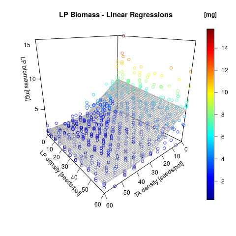
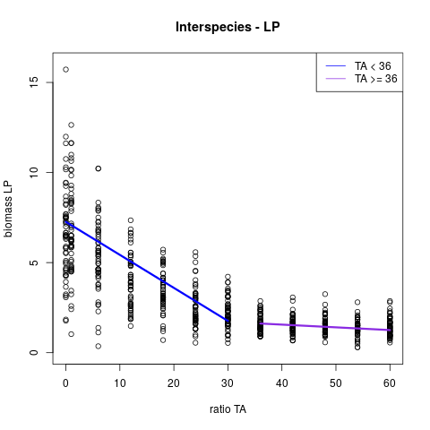
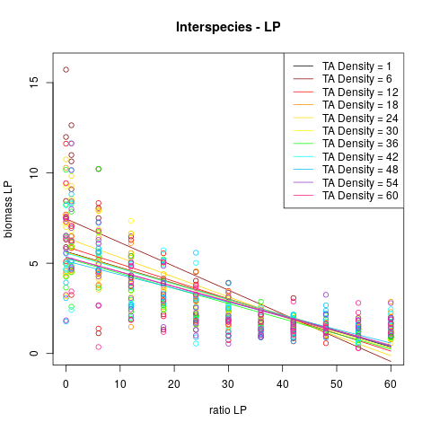

# Bachelor's project : Effect of density and interspecies competition on plant growth

## analysis.R
So all the analysis was done in this file. Depends on data.csv.

**warning :** it is bad practice do write your whole code in a single file like this, also there is harsh language in the comments. Yeah, we were students...

It will output a lot of different graphs and write the results of a few regressions into text files as well.

Multilinear regressions :

projection of the regression on a plane :

multiple projections :

some heatmaps :

!(hmap)[Biomass_var_TA.png)

please contact me if you'd like the whole report.
